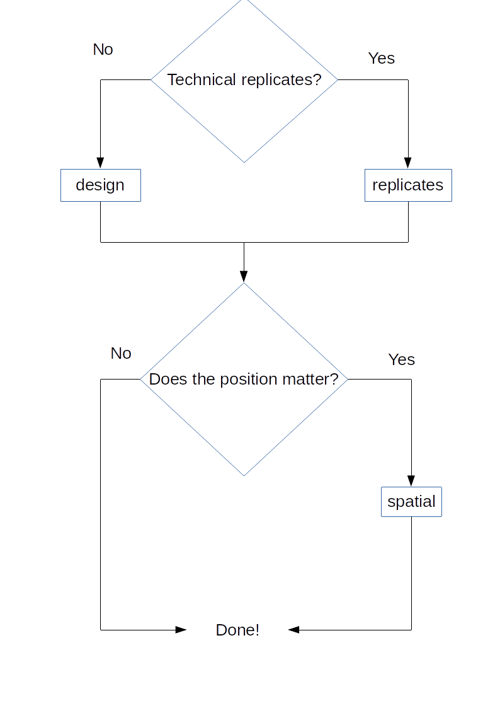

```{r setup, include=FALSE}
knitr::opts_chunk$set(collapse = TRUE, warning = TRUE, error = TRUE, fig.width = 9)
```

# Summary

The design of an experiment is critical to its success.
Nonetheless, even with a correct design, the process up to the moment of measurement is critical.
At any one of the several steps required from collection to measurement various errors and problems could affect the experimental results.
Failure to take such variability into account can render an experiment inconclusive.
*experDesign* provides tools to minimize the risk of inconclusive results by assigning samples to batches to minimize potential batch effects.

# Introduction

To properly design an experiment, the source of the variation between samples must be identified.
Typically, one can control the environment in which the study or experiment is being conducted.
Sometimes, however, this is not possible.
In this event, techniques to control such variations need to be applied.
There are three techniques used to decrease the uncertainty of the unwanted variation: blocking, randomization and replication [@klaus2015].

**Blocking** groups samples that are equal according to one or more variables, allowing the estimation of the differences between each batch by comparing measurements within blocks.
**Randomization** minimizes the variation in the measurements by randomly mixing the potential confounding variables.
**Replication** increases the number of samples used in an experiment to better estimate the variation of the experiment.
In some settings these techniques can be applied together to ensure the robustness of the study.

Between the designing of an experiment and the measurement of the samples, some samples might be lost, contaminated, or degradated below quality threshold.
Even if this does not happen, experiments will occasionally need to be carried out in batches.
Batches might be due to technical reasons, for example, the machine cannot measure more than a number of samples at the same time.
They can be also due to practical reasons, for instance, it may not be possible to obtain additional measurements in the field during the allotted time.

This divergence from the original design might cause batch effects perturbing the analysis.
There are several techniques to identify and assess batch effects when analyzing an already measured experiment [@leek2010].
However, if the source of variations is not taken into account before measurement is completed, a batch effect can be introduced that confounds the analysis.
Thus, it would be better to avoid such batch effects before executing an experiment.

To prevent the batch effect to confound an analysis after the initial design of the experiment, there are two options: randomization and replication.
Randomization, can help reduce variations across groups, while replication helps estimate the variation of the measurements or samples, thus increasing the precision of the estimates of the true value on the analysis.
Replications consist of increasing the number of measurements with similar attributes.
When a sample is measured multiple times, this is referred to as a technical replicate.
Technical replicates help estimate the variation of the measurement method, and thus the possible batch effect [@blainey2014].

Randomization and replicates can be used to prevent batch effects to confound the analysis.
However, by examining how the variables are distributed across each batch, proper randomization can be ensured, thus minimizing batch effects.
This is known as randomized block experimental design or stratified random sampling experimental design.

# State of the art

There are some tools to minimize batch effects on the R language in multiple fields and areas, and particularly for biological research [@rcoreteam2014].
Here we briefly describe the currently available packages:

-   *OSAT*, at [Bioconductor](https://bioconductor.org/packages/OSAT/), first allocates the samples from each batch according to a variable; it then shuffles the samples from each batch in order to randomize the other variables [@yan2012].
    This algorithm relies on categorical variables and cannot use numerical variables (e.g., age- or time-related) unless they are treated as categorical.

-   *anticlust*, at [CRAN](https://cran.r-project.org/package=anticlust), divides the samples into similar groups, ensuring similarity by enforcing heterogeneity within groups [@papenberg2020].
    Conceptually it is similar to the clustering methods k-means.

-   Recently, *Omixer*, a new package, has been made available at [Bioconductor](https://bioconductor.org/packages/Omixer/) [@sinke2021].
    It tests whether the random assignments made by it are homogeneous by transforming all variables to numeric values and using the Kendall's correlation when there are more than 5 samples; otherwise, it utilizes the Pearson's chi-squared test.

# Statement of need

Current solutions to stratify samples to reduce and control batch effect do not work for all cases and usual needs of researchers.
They are either specialized to specific type of data, omit some conditions that are often meet or only work on a specific subset of conditions.
The new package ***experDesign*** works on all kind of data types and doesn't require a spatial distribution making it suitable for all kind of experiments.
This package is intended for people looking for a quick and easy to interpret solution providing reasonable suggestions about how to distribute the samples on their analysis.

For completeness a description and comparison of the usage of the different software currently available on CRAN and Bioconductor is presented below.
First some real data from a survey:

```{r example-data}
data(survey, package = "MASS")
survey$ID <- seq_len(nrow(survey))
VoI <- c("Sex", "Smoke", "Age")
n_batch <- 3
size_subset <- 96
iterations <- 1000
```

This data set has three variables of interest; Sex, Smoke and Age are a mix of categorical and numeric variables.

## OSAT

OSAT provides some template for some setups and works for numeric and categorical variables:

```{r osat, fig.cap="Samples distributions with OSAT."}
library("ggplot2")
theme_plots <- theme_minimal() + theme(text = element_text(size = 10))
theme_set(theme_plots)
library("OSAT")
library("patchwork")
gs <- setup.sample(survey, optimal = VoI)
gc <- setup.container(plate = IlluminaBeadChip96Plate, n = n_batch, batch = 'plates')
gSetup <- create.optimized.setup(sample = gs, container = gc, nSim = iterations)
osat_report <- get.experiment.setup(gSetup)
nrow(osat_report)
osat_age <- ggplot(osat_report) +
  geom_histogram(aes(Age, fill = as.character(plates))) +
  facet_wrap(~plates) +
  labs(fill = "Batch")
osat_sex <- ggplot(osat_report) +
  geom_bar(aes(Sex, fill = as.character(plates))) +
  facet_wrap(~plates) +
  labs(fill = "Batch")
osat_smoke <- ggplot(osat_report) +
  geom_bar(aes(Smoke, fill = as.character(plates))) +
  facet_wrap(~plates) +
  labs(fill = "Batch")
(osat_smoke/(osat_age + osat_sex + plot_layout(guides = 'collect'))) +
  plot_annotation(title = "OSAT")
```

OSAT returns one row less that the input provided because it deletes one row because it has an NA value on the Sex variable.

## anticlust

anticlust doesn't handle all the variables, it only accepts numeric variables:

```{r anticlust, error=TRUE, fig.cap="Samples distributions with anticlust."}
library("anticlust")
anticlust_index <- anticlustering(
  survey[, VoI],
  K = n_batch,
  objective = "variance",
  method = "exchange",
  repetitions = iterations
)
anticlust_index <- anticlustering(
  survey[, "Age"],
  K = n_batch,
  objective = "variance",
  method = "exchange",
  repetitions = iterations
)
report_anticlust <- data.frame(Age = survey[, "Age"], batch = as.character(anticlust_index))
library("ggplot2")
ggplot(report_anticlust) + 
  geom_histogram(aes(Age, fill = batch)) +
  facet_wrap(~batch) +
  labs(fill = "Batch", title = "anticlust")
```

## Omixer

There is a bug on Omixer that prevents it to work unless specific conditions are meet.
That prevents it comparing with the other tools using the same settings:

```{r Omixer, error=TRUE}
library("Omixer")
survey$ID <- seq_len(nrow(survey))
Omixer_index <- omixerRand(survey, sampleId = "ID", 
                           block = "block", iterNum = 10, wells = size_subset, 
                           plateNum = n_batch, randVars = VoI, techVars = NULL)
Omixer_index <- omixerRand(survey, sampleId = "ID", 
                           block = "block", iterNum = 10, wells = size_subset, mask = rep(1, nrow(survey)),
                           plateNum = n_batch, randVars = VoI, techVars = NULL)
Omixer_index <- omixerRand(survey, sampleId = "ID", 
                           block = "block", iterNum = 10, wells = size_subset, mask = rep(0, nrow(survey)),
                           plateNum = n_batch, randVars = VoI, techVars = NULL)
Omixer_index <- omixerRand(survey, sampleId = "ID", 
                           block = "block", iterNum = 10, wells = size_subset, mask = rep(1, 288),
                           plateNum = n_batch, randVars = VoI, techVars = NULL)
Omixer_index <- omixerRand(survey, sampleId = "ID", 
                           block = "block", iterNum = 10, wells = size_subset, mask = rep(0, 288),
                           plateNum = n_batch, randVars = VoI, techVars = NULL)

```

# Description

The package ***experDesign*** provides the function `design` to arrange the samples into multiple batches such that the variable's distribution is homogeneous within each batch.
Each batch is set to have some centrality and dispersion statistics to match as closely as possible the original input design data.
The statistics used are the mean, the standard deviation, the median absolute deviation, variables with no value number, the entropy and the independence of the categorical variables.
On each iteration if the random distribution of samples' statitics for each batch has less differences with the original distribution than the last stored sample distribution then it replaces it as the best sample distribution.
At the end of the iterations the best sample distribution is returned to the user.

Users can follow the following flowchart to decide what function(s) they need to use:

{width="353"}

If users want a design without replicates but batches have some spatial distribution, we need to use `design` to allocate the samples on each batch and then the `spatial` function to randomly distribute the samples homogeneously by position within each batch.
The samples are distributed on each position as with the `design` function, only returning the distribution with less differences between the statistics previously mentioned with the original distribution to the user of all the iterations tried.
See below for an example:

```{r experDesign, fig.cap="Samples distributions with experDesign."}
library("experDesign")
experDesign_index <- design(survey[, VoI], size_subset = size_subset,
                  iterations = iterations, name = "")
experDesign_index_spatial <- spatial(index = experDesign_index, pheno = survey[, VoI], 
                                     iterations = iterations, rows = LETTERS[1:8], columns = 1:12)
experDesign_report <- inspect(experDesign_index, survey[, VoI])
nrow(experDesign_report)
experDesign_age <- ggplot(experDesign_report) + 
  geom_histogram(aes(Age, fill = batch)) +
  facet_wrap(~batch) +
  labs(fill = "Batch")
experDesign_sex <- ggplot(experDesign_report) +
  geom_bar(aes(Sex, fill = batch)) +
  facet_wrap(~batch) +
  labs(fill = "Batch")
experDesign_smoke <- ggplot(experDesign_report) +
  geom_bar(aes(Smoke, fill = batch)) +
  facet_wrap(~batch) +
  labs(fill = "Batch")
(experDesign_smoke/(experDesign_age + experDesign_sex + plot_layout(guides = 'collect'))) + plot_annotation(title = "experDesign")
```

The statistics of the index can be checked for multiple statistics, as shown in the following code:

```{r evaluate}
evaluate_na(experDesign_index, survey[, VoI])
evaluate_entropy(experDesign_index, survey[, VoI])
evaluate_mad(experDesign_index, survey[, VoI])
evaluate_sd(experDesign_index, survey[, VoI])
evaluate_mean(experDesign_index, survey[, VoI])
# All together for each batch
ei <- evaluate_index(experDesign_index, survey[, VoI])
ei[, , "SubSet1"]
evaluate_na(experDesign_index_spatial, survey[, VoI])
evaluate_entropy(experDesign_index_spatial, survey[, VoI])
evaluate_mad(experDesign_index_spatial, survey[, VoI])
evaluate_sd(experDesign_index_spatial, survey[, VoI])
evaluate_mean(experDesign_index_spatial, survey[, VoI])
# All together for each batch
ei <- evaluate_index(experDesign_index_spatial, survey[, VoI])
ei[, , "G1"]
```

We can also compare our results with the original distribution:

```{r original}
evaluate_orig(survey[, VoI])
```

In addition to distributing the samples into batches, ***experDesign*** provides tools to add technical replicates.
In order to choose them from the available samples, the function `extreme_cases` is provided.
For easier usage, the `replicates` function designs an experiment with the number of replicates per batch desired.
The rest of the workflow is similar to the above example:

```{r controls}
extreme_cases(survey[, VoI], size = 5)
replicates_index <- replicates(pheno = survey[, VoI], 
                               size_subset = size_subset, controls = 5, 
                               iterations = iterations)
spatial_replicate_index <- spatial(index = replicates_index, pheno = survey[, VoI], 
                                   rows = LETTERS[1:8], columns = 1:12)
survey$ID <- seq_len(nrow(survey))
report_replicates <- inspect(i = replicates_index, 
                             pheno = survey[, c(VoI, "ID")])
report_replicates_position <- inspect(i = spatial_replicate_index, 
                             pheno = report_replicates, 
                             index_name = "position")
# Batch and position where the samples should be:
head(report_replicates_position)
# Technical replicates:
head(report_replicates_position[duplicated(report_replicates_position$ID), ])
```

***experDesign*** also provides several small utilities to make it easier to design the experiment in batches.
For instance, a function called `sizes_batches` helps calculate the number of samples in order to distribute them across the batches required.
Furthermore, `optimum_batches` calculates the minimal amount of batches required:

```{r show-batches}
optimum_batches(size_data = 250, size_subset = 96)
sizes_batches(size_data = 250, size_subset = 96, batches = 3)
```

In conclusion the ***experDesign*** can be a first and fast step to prepare for a batched experiment.
It can use as many numeric and categorical variables as needed to stratify the experiment design on batches including spatial distributions.

# Acknowledgments

We are grateful to Joe Moore for English-language assistance.

# References
