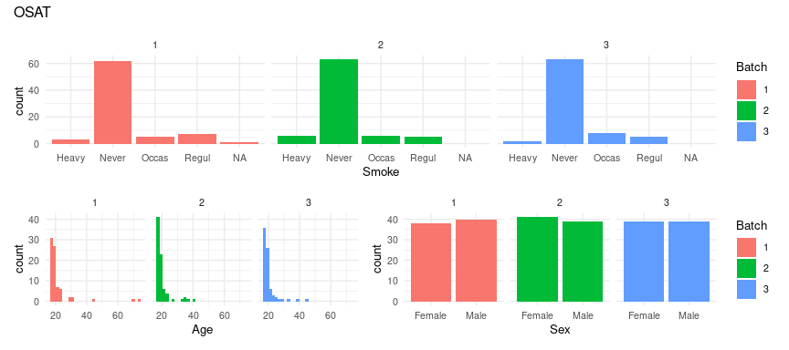
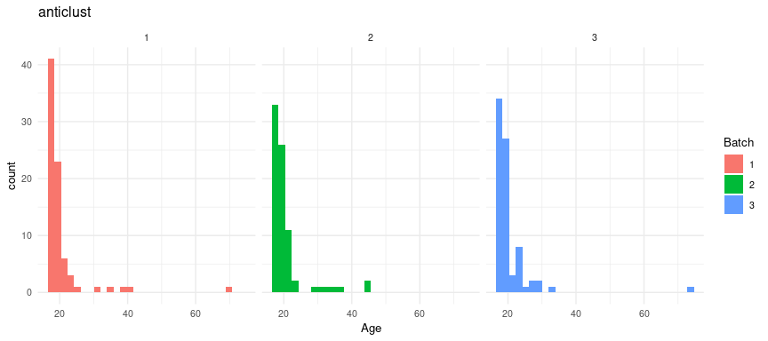
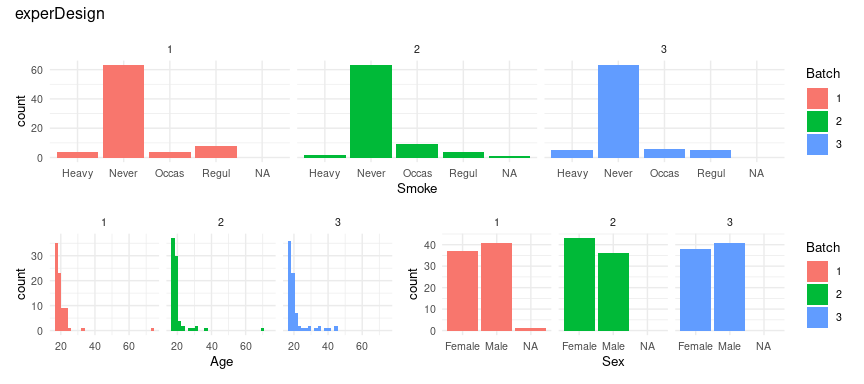

# Summary

The design of an experiment is critical to its success.
Nonetheless, even when correctly designed, the process leading up to the moment of measuring a given variable is critical.
At any one of the several steps, from sample collection to measurement of a variable, various errors and problems can affect the experimental results.
Failure to take such variability into account can render an experiment inconclusive.
*experDesign* provides tools to minimize the risk of inconclusive results by assigning samples to batches to reduce potential batch effects.

# Introduction

To design an experiment that can support conclusive results upon analysis, the source of the variation between samples must be identified.
Typically, one can control the environment in which the study or experiment is being conducted.
Sometimes, however, this is not possible.
In such cases, techniques to control variations must to be applied.
There are three methods used to decrease the uncertainty of the unwanted variation: blocking, randomization and replication [@klaus2015].

**Blocking** is a method that groups samples that are equal according to one or more variables, allowing the estimation of the differences between each batch by comparing measurements within the blocks.
**Randomization** minimizes the variation in the measurements by randomly mixing the potential confounding variables.
**Replication** increases the number of samples used in an experiment to better estimate the variation of the experiment.
In some settings these techniques can be applied together to enhance the robustness of the study.

Between the designing of an experiment and the measurement of the samples, some samples might be lost, contaminated, or degraded below the quality threshold.
In addition, experiments will occasionally need to be carried out in batches.
The later might be needed for technical reasons; for example, the device cannot measure more than a given number of samples at the same time.
Practical reasons can also be a factor; for instance, it may not be possible to obtain additional measurements in the field during the allotted time.

This divergence from the original design might cause batch effects, thereby perturbing the analysis.
There are several techniques to identify and assess batch effects when analyzing an already measured experiment [@leek2010].
It would be better to avoid such batch effects before executing an experiment.
By taking into account the differences between the original design and the state before the measurement is conducted, confounding effects can be minimized.

To prevent the batch effect from confounding the analysis after the initial design of the experiment, there are two options: randomization and replication.
Randomization, consists of shuffling the samples in order to mix different attributes, which can help reduce variations across groups.
In contrast, replication helps estimate the variation of the measurements or samples, thus increasing the precision of the estimates of the true value obtained by the analysis.
Replications consist of increasing the number of measurements with similar attributes.
When a sample is measured multiple times, this is referred to as a technical replicate.
Technical replicates help estimate the variation of the measurement method, and thus the possible batch effect [@blainey2014].

Randomization and replication can be used to prevent batch effects that might confound the analysis.
By examining how the variables are distributed across each batch, proper randomization can be ensured, thus minimizing batch effects.
This is known as randomized block experimental design or stratified random sampling experimental design.

# State of the art

There are certain tools that can minimize batch effects on the R language in multiple fields, particularly for biological research [@rcoreteam2014].
Here we briefly describe the currently available packages:

-   [*OSAT*](https://bioconductor.org/packages/OSAT/), at Bioconductor, first allocates the samples from each batch according to a variable; it then shuffles the samples from each batch in order to randomize the other variables [@yan2012].
    This algorithm relies on categorical variables and cannot use numerical variables (e.g., those that are age- or time-related) unless they are treated as categorical variables.

-   [*anticlust*](https://cran.r-project.org/package=anticlust), at CRAN, divides the samples into similar groups, ensuring similarity by enforcing heterogeneity within groups [@papenberg2020].
    Conceptually it is similar to the clustering method k-means.

-   Recently, [*Omixer*](https://bioconductor.org/packages/Omixer/), a new package, has been made available at Bioconductor [@sinke2021].
    It tests whether the random assignments made by it are homogeneous by transforming all variables to numeric values and using the Kendall's correlation when there are more than 5 samples; otherwise, it utilizes the Pearson's chi-squared test.

# Statement of need

Current solutions for stratifying samples to reduce and control batch effect do not work for all cases.
They are either specialized to a particular type of data, they omit some conditions that are usually met, or they only work under a specific subset of conditions.
The new package ***experDesign*** works with all data types and does not require a spatial distribution making it suitable for all kind of experiments.
This package is intended for people needing a quick and easy solution that will provide reasonable suggestions on how to best distribute the samples for analysis.

For completeness a description and comparison of the usage of the different software packages currently available on CRAN and Bioconductor is presented below.
First, we start with some real data obtained from a survey:


```r
data(survey, package = "MASS")
survey$ID <- seq_len(nrow(survey))
VoI <- c("Sex", "Smoke", "Age")
n_batch <- 3
size_subset <- 96
iterations <- 1000
```

This data set has three variables of interest; Sex, Smoke and Age are a mix of categorical and numeric variables.

## OSAT

OSAT provides templates for plates that hold 2, 4, 8 Illumina BeadChip chips, having 24, 48 or 96 wells.
Moreover, it works for both numeric and categorical variables:


```r
library("ggplot2")
theme_plots <- theme_minimal() + theme(text = element_text(size = 10))
theme_set(theme_plots)
library("OSAT")
library("patchwork")
gs <- setup.sample(survey, optimal = VoI)
gc <- setup.container(plate = IlluminaBeadChip96Plate, n = n_batch, batch = 'plates')
gSetup <- create.optimized.setup(sample = gs, container = gc, nSim = iterations)
## Warning in create.optimized.setup(sample = gs, container = gc, nSim =
## iterations): Using default optimization method: optimal.shuffle
osat_report <- get.experiment.setup(gSetup)
nrow(osat_report)
## [1] 236
osat_age <- ggplot(osat_report) +
  geom_histogram(aes(Age, fill = as.character(plates))) +
  facet_wrap(~plates) +
  labs(fill = "Batch")
osat_sex <- ggplot(osat_report) +
  geom_bar(aes(Sex, fill = as.character(plates))) +
  facet_wrap(~plates) +
  labs(fill = "Batch")
osat_smoke <- ggplot(osat_report) +
  geom_bar(aes(Smoke, fill = as.character(plates))) +
  facet_wrap(~plates) +
  labs(fill = "Batch")
(osat_smoke/(osat_age + osat_sex + plot_layout(guides = 'collect'))) +
  plot_annotation(title = "OSAT")
## `stat_bin()` using `bins = 30`. Pick better value with `binwidth`.
```



OSAT returned one row less than the input provided.
This row was deleted because it had an NA value for the Sex variable.

## anticlust

anticlust does not handle all the variables, it only accepts numeric variables:


```r
library("anticlust")
anticlust_index <- anticlustering(
  survey[, VoI],
  K = n_batch,
  objective = "variance",
  method = "exchange",
  repetitions = iterations
)
## Error in validate_data_matrix(x): Your data (the first argument `x`) should only contain numeric entries, but this is not the case.
anticlust_index <- anticlustering(
  survey[, "Age"],
  K = n_batch,
  objective = "variance",
  method = "exchange",
  repetitions = iterations
)
report_anticlust <- data.frame(Age = survey[, "Age"], batch = as.character(anticlust_index))
library("ggplot2")
ggplot(report_anticlust) + 
  geom_histogram(aes(Age, fill = batch)) +
  facet_wrap(~batch) +
  labs(fill = "Batch", title = "anticlust")
## `stat_bin()` using `bins = 30`. Pick better value with `binwidth`.
```



## Omixer

There is a bug in the Omixer that prevents it from working unless specific conditions are meet.
This precluded any comparisons of Omixer with other tools using the same settings:


```r
library("Omixer")
survey$ID <- seq_len(nrow(survey))
Omixer_index <- omixerRand(survey, sampleId = "ID", 
                           block = "block", iterNum = 10, wells = size_subset, 
                           plateNum = n_batch, randVars = VoI, techVars = NULL)
## Error in omixerRand(survey, sampleId = "ID", block = "block", iterNum = 10, : Number of unmasked wells must equal number of samples.
Omixer_index <- omixerRand(survey, sampleId = "ID", 
                           block = "block", iterNum = 10, wells = size_subset, mask = rep(1, nrow(survey)),
                           plateNum = n_batch, randVars = VoI, techVars = NULL)
## Error: Tibble columns must have compatible sizes.
## * Size 288: Existing data.
## * Size 237: Column `mask`.
## ℹ Only values of size one are recycled.
Omixer_index <- omixerRand(survey, sampleId = "ID", 
                           block = "block", iterNum = 10, wells = size_subset, mask = rep(0, nrow(survey)),
                           plateNum = n_batch, randVars = VoI, techVars = NULL)
## Error: Tibble columns must have compatible sizes.
## * Size 288: Existing data.
## * Size 237: Column `mask`.
## ℹ Only values of size one are recycled.
Omixer_index <- omixerRand(survey, sampleId = "ID", 
                           block = "block", iterNum = 10, wells = size_subset, mask = rep(1, 288),
                           plateNum = n_batch, randVars = VoI, techVars = NULL)
## Error in omixerRand(survey, sampleId = "ID", block = "block", iterNum = 10, : Number of unmasked wells must equal number of samples.
Omixer_index <- omixerRand(survey, sampleId = "ID", 
                           block = "block", iterNum = 10, wells = size_subset, mask = rep(0, 288),
                           plateNum = n_batch, randVars = VoI, techVars = NULL)
## Error in omixerRand(survey, sampleId = "ID", block = "block", iterNum = 10, : Number of unmasked wells must equal number of samples.
```

# Description

The package ***experDesign*** provides the function `design` to arrange the samples into multiple batches such that a variable's distribution remains homogeneous within each batch.
Each batch is set to have some centrality and dispersion statistics to match as closely as possible with the original input design data.
The statistics used are the mean, the standard deviation, the median absolute deviation, variables with no value number, the entropy and the independence of the categorical variables.
With each iteration if the random distribution of the sample statistics for each batch has fewer differences vis-à-vis the original distribution than the last stored sample distribution then it replaces it as the best sample distribution.
Upon completion of the iterations the best sample distribution is returned to the user.

Users can examine the following flowchart to decide what function(s) they need to use:

{width="353"}

If users want a design without replicates but the batches have some spatial distribution, we must use `design` to allocate the samples on each batch, followed by the `spatial` function to randomly distribute the samples homogeneously by position within each batch.
See the example below:


```r
library("experDesign")
experDesign_index <- design(survey[, VoI], size_subset = size_subset,
                  iterations = iterations, name = "")
experDesign_index_spatial <- spatial(index = experDesign_index, pheno = survey[, VoI], 
                                     iterations = iterations, rows = LETTERS[1:8], columns = 1:12)
experDesign_report <- inspect(experDesign_index, survey[, VoI])
nrow(experDesign_report)
## [1] 237
experDesign_age <- ggplot(experDesign_report) + 
  geom_histogram(aes(Age, fill = batch)) +
  facet_wrap(~batch) +
  labs(fill = "Batch")
experDesign_sex <- ggplot(experDesign_report) +
  geom_bar(aes(Sex, fill = batch)) +
  facet_wrap(~batch) +
  labs(fill = "Batch")
experDesign_smoke <- ggplot(experDesign_report) +
  geom_bar(aes(Smoke, fill = batch)) +
  facet_wrap(~batch) +
  labs(fill = "Batch")
(experDesign_smoke/(experDesign_age + experDesign_sex + plot_layout(guides = 'collect'))) + plot_annotation(title = "experDesign")
## `stat_bin()` using `bins = 30`. Pick better value with `binwidth`.
```



The statistics of the index can be checked for multiple statistics, as shown in the following code:


```r
evaluate_na(experDesign_index, survey[, VoI])
##       Sex     Smoke       Age 
## 0.4444444 0.4444444 0.0000000
evaluate_entropy(experDesign_index, survey[, VoI])
##        Sex      Smoke 
## 0.00286977 0.49312642
evaluate_mad(experDesign_index, survey[, VoI])
##      Age 
## 25.86297
evaluate_sd(experDesign_index, survey[, VoI])
##       Age 
## 0.1469049
evaluate_mean(experDesign_index, survey[, VoI])
##       Age 
## 0.4121125
# All together for each batch
ei <- evaluate_index(experDesign_index, survey[, VoI])
ei[, , "SubSet1"]
## Error in ei[, , "SubSet1"]: subscript out of bounds
evaluate_na(experDesign_index_spatial, survey[, VoI])
##        Sex      Smoke        Age 
## 0.02061632 0.02061632 0.00000000
evaluate_entropy(experDesign_index_spatial, survey[, VoI])
##       Sex     Smoke 
## 0.3648235 1.0000000
evaluate_mad(experDesign_index_spatial, survey[, VoI])
##      Age 
## 25.66835
evaluate_sd(experDesign_index_spatial, survey[, VoI])
##      Age 
## 5.227784
evaluate_mean(experDesign_index_spatial, survey[, VoI])
##      Age 
## 2.237893
# All together for each batch
ei <- evaluate_index(experDesign_index_spatial, survey[, VoI])
ei[, , "G1"]
##          variables
## stat            Sex     Smoke        Age
##   mean    0.0000000 0.0000000 19.8056667
##   sd      0.0000000 0.0000000  0.3466776
##   mad     0.0000000 0.0000000  0.2461116
##   na      0.0000000 0.0000000  0.0000000
##   entropy 0.9182958 0.9182958  0.0000000
```

We can also compare our results with the original distribution:


```r
evaluate_orig(survey[, VoI])
##         Sex     Smoke       Age
## mean      0 0.0000000 20.374515
## sd        0 0.0000000  6.474335
## mad       0 0.0000000  1.605656
## na        1 1.0000000  0.000000
## entropy   1 0.5143828  0.000000
```

In addition to distributing the samples into batches, ***experDesign*** provides tools to add technical replicates.
In order to choose them from the available samples, the function `extreme_cases` is provided.
For easier usage, the `replicates` function designs an experiment with the desired number of replicates per batch.
The rest of the workflow is similar to the above example:


```r
extreme_cases(survey[, VoI], size = 5)
## [1]  62 103 171 176 192
replicates_index <- replicates(pheno = survey[, VoI], 
                               size_subset = size_subset, controls = 5, 
                               iterations = iterations)
spatial_replicate_index <- spatial(index = replicates_index, pheno = survey[, VoI], 
                                   rows = LETTERS[1:8], columns = 1:12)
survey$ID <- seq_len(nrow(survey))
report_replicates <- inspect(i = replicates_index, 
                             pheno = survey[, c(VoI, "ID")])
report_replicates_position <- inspect(i = spatial_replicate_index, 
                             pheno = report_replicates, 
                             index_name = "position")
# Batch and position where the samples should be:
head(report_replicates_position)
##      Sex Smoke    Age ID   batch position
## 1 Female Never 18.250  1 SubSet1       B7
## 2   Male Regul 17.583  2 SubSet1       C5
## 3   Male Occas 16.917  3 SubSet1       D8
## 4   Male Never 20.333  4 SubSet2       A3
## 5   Male Never 23.667  5 SubSet1       E3
## 6 Female Never 21.000  6 SubSet1       C5
# Technical replicates:
head(report_replicates_position[duplicated(report_replicates_position$ID), ])
##         Sex Smoke    Age ID   batch position
## 11.3 Female Never 28.500 11 SubSet1       F4
## 11.4 Female Never 28.500 11 SubSet1      C12
## 11.1 Female Never 28.500 11 SubSet2      A12
## 11.2 Female Never 28.500 11 SubSet3      H11
## 20.1   Male Never 17.917 20 SubSet3       D3
## 20.2   Male Never 17.917 20 SubSet3      G12
```

***experDesign*** also provides several small utilities to make it easier to design the experiment in batches.
For instance, a function called `sizes_batches` helps calculate the number of samples in order to distribute them across the required batches.
Furthermore, `optimum_batches` calculates the minimal number of batches required:


```r
optimum_batches(size_data = 250, size_subset = 96)
## [1] 3
sizes_batches(size_data = 250, size_subset = 96, batches = 3)
## [1] 84 83 83
```

In conclusion ***experDesign*** offers a fast method for preparing a batched experiment.
It can use as many numeric and categorical variables as needed to stratify the experimental design based on batches including spatial distributions.

# Acknowledgments

We are grateful to Joe Moore for English-language assistance.

# References
